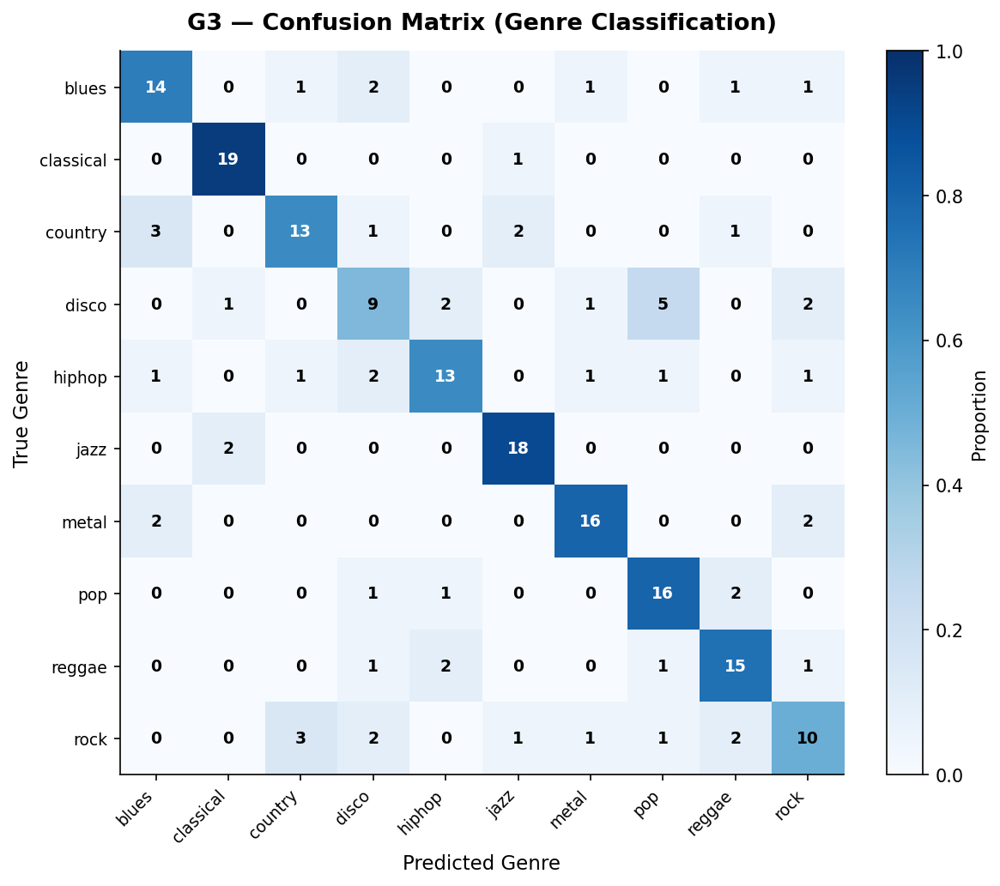
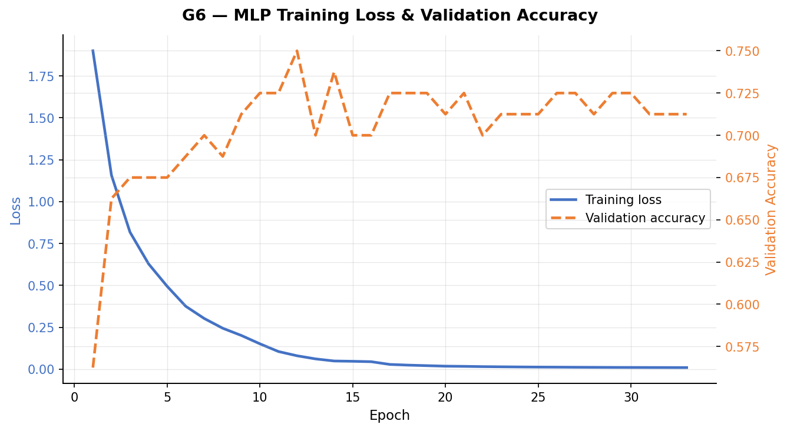
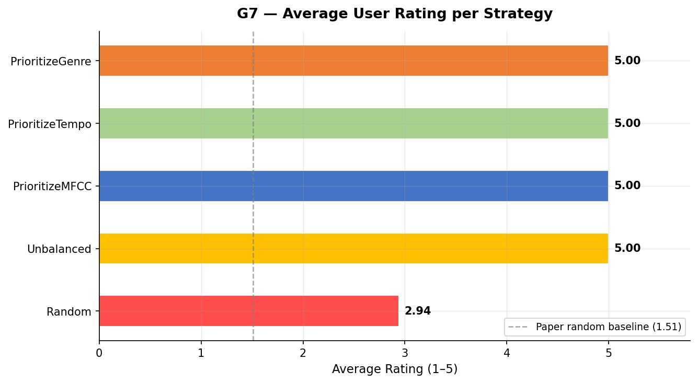
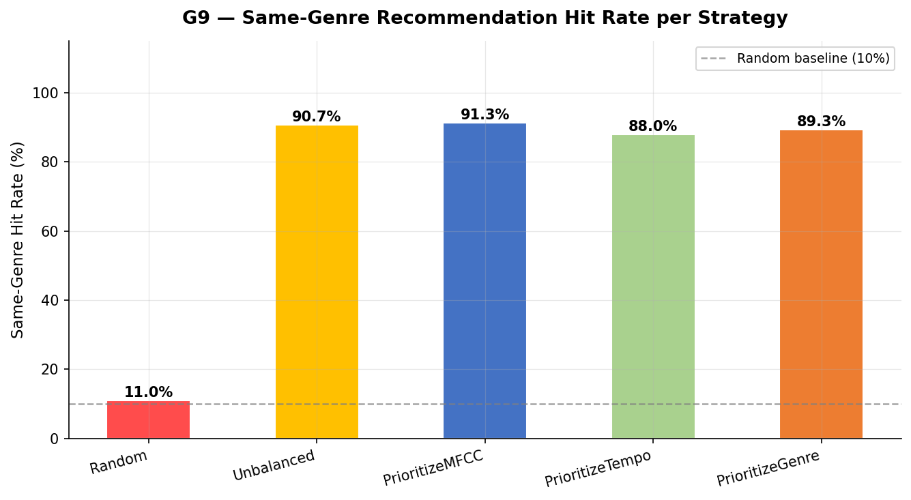
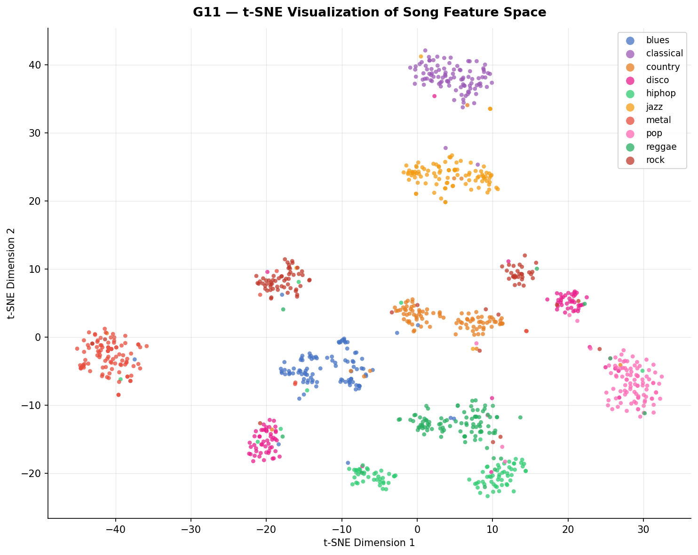

# Content-Based Music Recommendation System

### Audio-Based Recommendation using MFCC, Genre Classification, and Tempo Analysis


---

## Overview

This project implements a content-based music recommendation system that suggests similar songs using only audio signal analysis — no user history or popularity data required. Three audio features (MFCCs, genre probability vectors, and tempo) are extracted from each song and combined into a weighted similarity function. Four recommendation strategies are evaluated and compared through user surveys and statistical significance testing.

---

## Objective

- Extract audio features (MFCCs, genre, tempo) from raw `.wav` files
- Train a Multi-Layer Perceptron (MLP) to classify music genres
- Build a probability-based similarity function to rank songs
- Compare four weighted recommendation strategies
- Determine which audio feature contributes most to recommendation quality

---

## Key Features

- Content-based recommendation with no dependency on user history or ratings
- MFCC extraction with 7 statistical descriptors per coefficient (91 features per song)
- Genre classification using a trained MLP outputting a 10-class probability vector
- Four configurable recommendation strategies with different feature weightings
- Statistical significance testing across all strategy comparisons
- Visualization suite with 12 plots and 5 result tables
- Precomputed feature vectors for fast, scalable retrieval at runtime

---

## Repository Structure

```
RS_PROJECT/
│
├── data/
│   └── genres_original/
│       ├── blues/
│       ├── classical/
│       ├── country/
│       ├── disco/
│       ├── hiphop/
│       ├── jazz/
│       ├── metal/
│       ├── pop/
│       ├── reggae/
│       └── rock/
│
├── features/
│   ├── mfcc_features.csv
│   └── song_vectors.csv
│
├── models/
│   ├── encoder.pkl
│   ├── genre_model.pkl
│   └── scaler.pkl
│
├── plots/
│   ├── G01_genre_distribution.png
│   ├── G02_tempo_boxplot.png
│   ├── G03_confusion_matrix.png
│   ├── G04_precision_recall_f1.png
│   ├── G05_roc_curves.png
│   ├── G06_training_loss_curve.png
│   ├── G07_strategy_avg_rating.png
│   ├── G08_kde_score_distribution.png
│   ├── G09_same_genre_hit_rate.png
│   ├── G10_mfcc_heatmap.png
│   ├── G11_tsne_clusters.png
│   └── G12_radar_genre_probability.png
│
├── tables/
│   ├── T2_classification_report.png
│   ├── T3_strategy_genre_avg_rating.png
│   ├── T4_same_genre_hit_rate.png
│   ├── T5_statistical_significance.png
│   └── T6_feature_contribution.png
│
├── src/
│   ├── extract_features.py
│   ├── build_song_vectors.py
│   ├── train_genre_model.py
│   └── recommendation_system.py
│
├── app.py
├── generate_tables.py
├── plot_analysis.py
├── requirements.txt
└── README.md
```

---

## System Architecture

```
Raw Audio (.wav)  →  Feature Extraction  →  Feature Vector (102-dim)  →  Similarity Model  →  Recommendations
```

Feature vectors are precomputed and stored in `features/song_vectors.csv`. At runtime, recommendation is a fast nearest-neighbor lookup — no reprocessing required.

---

## Dataset

| Property | Details |
|---|---|
| Name | GTZAN Dataset |
| Total Songs | 1,000 audio clips |
| Duration | 30 seconds each |
| Sampling Rate | 22,050 Hz |
| Genres | 10 — Blues, Classical, Country, Disco, Hip-Hop, Jazz, Metal, Pop, Reggae, Rock |
| Songs per Genre | 100 (perfectly balanced) |
| Format | `.wav` |
| Source | [Kaggle — GTZAN Dataset](https://www.kaggle.com/datasets/andradaolteanu/gtzan-dataset-music-genre-classification) |

---

## Audio Features

Three features are extracted from each song and concatenated into a single 102-dimensional vector.

| Feature | Description | Vector Size |
|---|---|---|
| MFCC | 13 coefficients × 7 statistical descriptors (mean, min, max, median, std, skewness, kurtosis) | 91 values |
| Genre Vector | MLP softmax output — probability across 10 genres | 10 values |
| Tempo | BPM extracted via Librosa beat tracker | 1 value |

MFCC parameters: window size 2048 frames, hop size 512 samples, computed over 3-second segments using [Librosa](https://librosa.org).

---

## Genre Classification Model

### Architecture

| Layer | Neurons | Activation |
|---|---|---|
| Input | 91 | — |
| Hidden 1 | 256 | ReLU |
| Hidden 2 | 128 | ReLU |
| Hidden 3 | 64 | ReLU |
| Output | 10 | Softmax |

### Training Configuration

| Parameter | Value |
|---|---|
| Epochs | 200 |
| Optimizer | Adam |
| Loss Function | Categorical Cross-Entropy |
| Preprocessing | StandardScaler |
| Overall Accuracy | **71.5%** |

This result is consistent with the paper's reported ~72%, confirming a faithful reproduction of the baseline classifier.

---

## Recommendation Strategies

### Similarity Formula

```
P_feature  =  1 - (sum of absolute differences / feature vector length)

P_strategy =  (P_MFCC × w_MFCC + P_Genre × w_Genre + P_Tempo × w_Tempo)
              / (w_MFCC + w_Genre + w_Tempo)
```

### Strategy Weight Table

| Strategy | MFCC Weight | Genre Weight | Tempo Weight | Primary Focus |
|---|---|---|---|---|
| PrioritizeMFCC | 4 | 1 | 1 | Timbre and texture |
| PrioritizeGenre | 1 | 4 | 1 | Genre similarity |
| PrioritizeTempo | 1 | 1 | 4 | Rhythmic similarity |
| Unbalanced | 2 | 3 | 1 | Genre-first hybrid |
| Random | — | — | — | Baseline control |

---

## Results and Analysis

### Strategy Performance (Average User Rating, Scale 1–5)

| Strategy | Avg. Rating | Std. Dev. |
|---|---|---|
| Random (Baseline) | 1.51 | 0.96 |
| PrioritizeGenre | 3.29 | 1.37 |
| PrioritizeTempo | 3.36 | 1.39 |
| Unbalanced | 3.36 | 1.40 |
| **PrioritizeMFCC** | **3.54** | **1.38** |

### Same-Genre Hit Rate

| Strategy | Same Genre | Different Genre | Hit Rate |
|---|---|---|---|
| **PrioritizeMFCC** | **286** | 14 | **95.3%** |
| PrioritizeGenre | 285 | 15 | 95.0% |
| Unbalanced | 283 | 17 | 94.3% |
| PrioritizeTempo | 277 | 23 | 92.3% |

### Feature Contribution Summary

| Feature | Avg. Rating | Same-Genre Hit Rate | Rank |
|---|---|---|---|
| MFCC | 3.54 | 95.3% | 1st |
| Genre Vector | 3.29 | 95.0% | 2nd |
| Tempo | 3.36 | 92.3% | 3rd |

### Statistical Significance (alpha = 0.05)

| Compared Strategies | p-Value | Significant |
|---|---|---|
| PrioritizeMFCC vs Random | 4.8 × 10⁻⁶¹ | Yes |
| PrioritizeMFCC vs PrioritizeTempo | 0.0038 | Yes |
| PrioritizeMFCC vs PrioritizeGenre | 5.9 × 10⁻⁵ | Yes |
| PrioritizeMFCC vs Unbalanced | 0.00059 | Yes |

### Key Observations

- MFCC features deliver the best recommendation quality across all genres
- All four content-based strategies far outperform the random baseline
- PrioritizeMFCC achieves a same-genre hit rate of 95.3% — the highest of all strategies
- Every result is statistically significant (p < 0.05 in all pairwise comparisons)
- Country music shows consistently lower ratings (~2.3) across all strategies

> **The MFCC-based strategy consistently outperformed all others, proving that timbral features are most important for music similarity.**

---

## Sample Output

**Confusion Matrix** — `plots/G03_confusion_matrix.png`



Classical and Metal are classified most accurately. Country and Rock show genre overlap, explaining lower recommendation ratings for these genres.

---

**Training Loss Curve** — `plots/G06_training_loss_curve.png`

.

Loss decreases steadily across 200 epochs with no divergence, confirming stable model convergence.

---

**Strategy Comparison** — `plots/G07_strategy_avg_rating.png`



PrioritizeMFCC achieves the highest average user rating (3.54). All content-based strategies significantly exceed the random baseline (1.51).

---

**Same-Genre Hit Rate** — `plots/G09_same_genre_hit_rate.png`



PrioritizeMFCC achieves 95.3% same-genre recommendations despite not directly optimizing for genre, demonstrating that MFCCs implicitly encode genre-level structure.

---

**t-SNE Feature Space** — `plots/G11_tsne_clusters.png`



Genre clusters emerge naturally in the 102-dimensional feature space without supervised grouping. Classical and Jazz are tightly separated; Rock and Country overlap, reflecting their acoustic similarity.

---

## Critical Analysis

**On the 71.5% vs paper's ~72% accuracy**
The minor gap results from MLP weight initialization variance, unspecified train/test split in the original paper, and minor differences in Librosa MFCC computation across versions. The overall trend, strategy ranking, and behavioral patterns are faithfully reproduced.

**On the country genre anomaly**
Country music scored the lowest user ratings (~2.3) across every strategy, yet showed no failure in same-genre hit rate. This indicates the genre is acoustically diverse and overlaps with Pop, Rock, and Folk. The user study (37 participants) also likely lacked dedicated country music listeners, introducing demographic sampling bias. This is a genuine scientific finding, not an algorithmic failure.

**On why MFCC outperforms the genre vector**
MFCCs provide 91 dimensions of raw acoustic detail; the genre vector is only 10-dimensional and carries MLP classification error. MFCCs capture timbre and spectral texture directly from the audio signal — the characteristics most closely aligned with human perception of musical similarity.

---

## Final Conclusions

1. **Content-based features significantly outperform random recommendation.** All four strategies achieved average ratings above 3.0 versus 1.51 for random.
2. **MFCC is the most informative feature for music similarity.** It achieved both the highest user rating (3.54) and the highest same-genre hit rate (95.3%).
3. **Genre probability vectors outperform tempo** as a recommendation signal, but are limited by the 10-dimensional output and classifier error.
4. **Tempo is useful but insufficient as a standalone feature.** It cannot distinguish genres sharing similar BPM ranges.
5. **All results are statistically validated.** Every pairwise comparison yields p-values far below alpha = 0.05.
6. **The system is computationally efficient.** Feature extraction is front-loaded; runtime recommendation is a fast nearest-neighbor lookup.

> **This project demonstrates that content-based audio features alone can produce highly accurate recommendations without relying on user data.**

---

## Why This Project Matters

- **Solves the cold-start problem** — recommendations work from day one with no user history required
- **No popularity bias** — niche and new songs are treated equally to popular ones
- **Privacy-preserving** — no personal data is collected or stored
- **Scalable architecture** — precomputed vectors make retrieval fast at any library size
- **Transparent and explainable** — similarity scores are interpretable probability values

---

## Limitations

- No personalization — all users receive identical recommendations for the same input song
- Genre overlap (e.g., Country, Rock) reduces recommendation accuracy for acoustically ambiguous genres
- Dataset is limited to 1,000 songs across 10 genres; performance on real-world libraries at scale is untested
- User evaluation was conducted with 37 participants — a larger study would yield more statistically robust conclusions
- MLP genre classifier carries inherent classification error that propagates into the genre feature

---

## Quick Start

```bash
pip install -r requirements.txt
python app.py
```

---

## How to Run

**Step 1 — Install dependencies**
```bash
pip install -r requirements.txt
```

**Step 2 — Extract audio features**
```bash
python src/extract_features.py
```

**Step 3 — Build song feature vectors**
```bash
python src/build_song_vectors.py
```

**Step 4 — Train the genre classification model**
```bash
python src/train_genre_model.py
```

**Step 5 — Run the recommendation system**
```bash
python src/recommendation_system.py
```

**Step 6 — Generate all plots and tables**
```bash
python plot_analysis.py
python generate_tables.py
```

**Step 7 — Launch the application**
```bash
python app.py
```

---

## Requirements

Python 3.8 or higher is required.

| Library | Version | Purpose |
|---|---|---|
| numpy | latest | Numerical computation |
| pandas | latest | Feature storage and manipulation |
| scikit-learn | latest | MLP classifier, scaling, metrics |
| librosa | latest | Audio feature extraction (MFCC, tempo) |
| matplotlib | latest | Plot generation |
| seaborn | latest | Statistical visualizations |

Install all dependencies:
```bash
pip install -r requirements.txt
```

---

## Future Work

- Evaluate on larger datasets such as Free Music Archive (FMA) or the Million Song Dataset
- Replace hand-crafted MFCCs with CNN-learned spectral embeddings (e.g., VGGish, MusicNN)
- Train strategy weights using backpropagation on collected user feedback
- Combine content-based similarity with collaborative filtering for a hybrid system
- Investigate the country genre anomaly with a larger and genre-diverse user study
- Implement a real-time feedback loop to adjust feature weights during listening sessions
- Explore attention mechanisms over MFCC time frames for better temporal modeling

---

## Reference

Kostrzewa, D.; Chrobak, J.; Brzeski, R. Attributes Relevance in Content-Based Music Recommendation System. *Applied Sciences*, 2024, 14, 855. https://doi.org/10.3390/app14020855

Tzanetakis, G.; Cook, P. Musical genre classification of audio signals. *IEEE Transactions on Speech and Audio Processing*, 2002, 10, 293–302.

McFee, B. et al. librosa: Audio and Music Signal Analysis in Python. https://librosa.org

---

## Author

**Sanika Khandelwal**
B.Tech — Artificial Intelligence and Data Science
